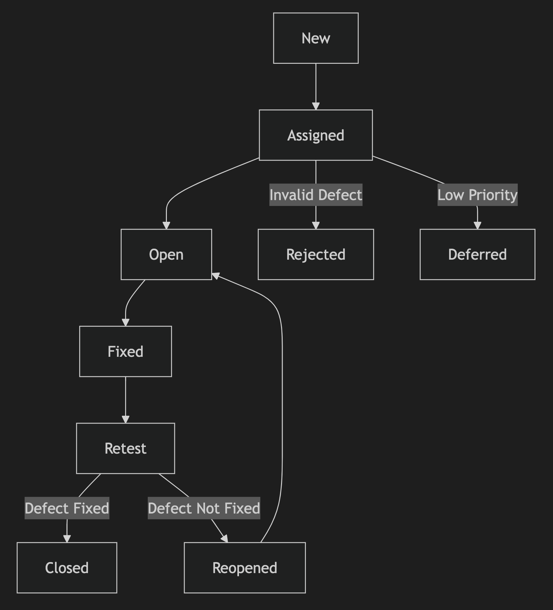
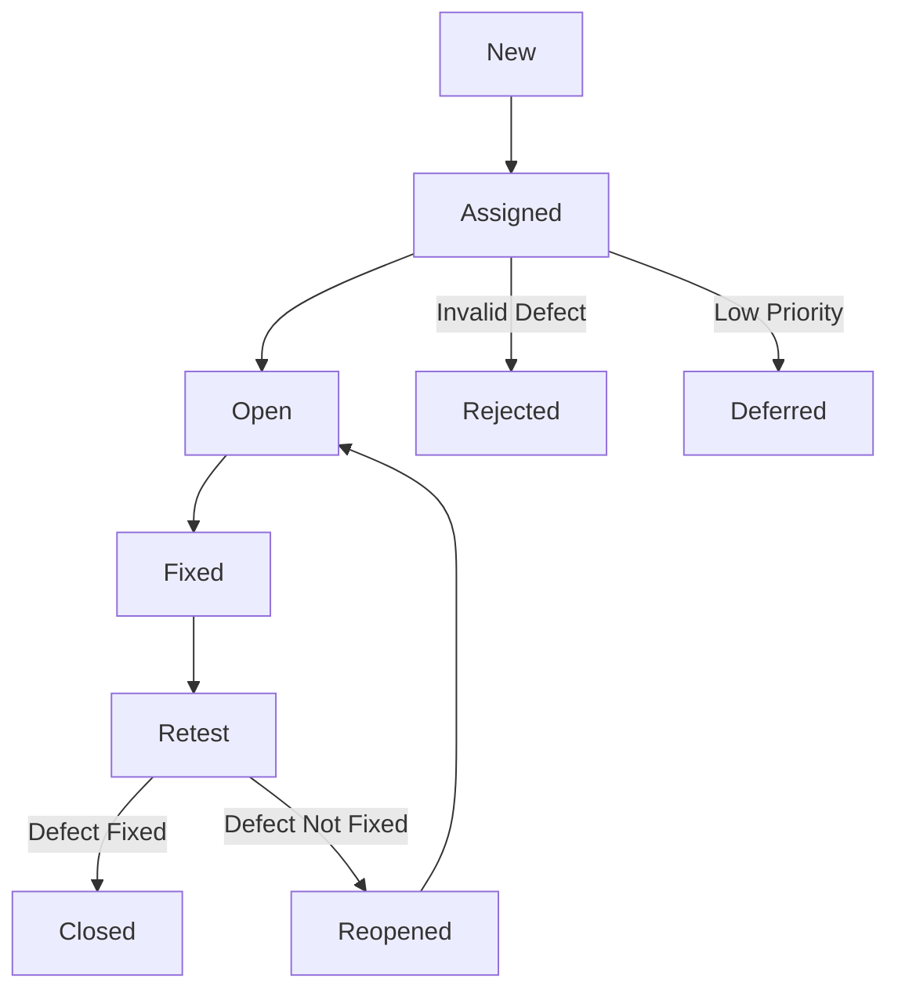

# Defect Lifecycle and Defect Lifecycle Workflow

---

## 1. What is a Defect Lifecycle?

The **Defect Lifecycle** (also known as **Bug Lifecycle**) refers to the **process through which a defect or bug goes** from its identification to resolution and closure. It describes the **states or stages** a defect transitions through as it is logged, analyzed, fixed, tested, and closed. 

The goal of the defect lifecycle is to ensure that **all defects are tracked, managed, and resolved efficiently**, ensuring the quality of the software.

---

## 2. Stages of the Defect Lifecycle

Below are the **typical stages** a defect passes through in its lifecycle:

### 1. **New**:
- When a tester identifies a defect, it is logged in the defect management tool with a **status of "New."**
- The defect is documented with relevant details (e.g., steps to reproduce, screenshots, severity, priority).

### 2. **Assigned**:
- The defect is **reviewed** by the project manager or team lead, and it is assigned to a **developer** or team for further analysis and resolution.

### 3. **Open**:
- The developer acknowledges the defect and changes its status to **"Open"**. 
- The developer starts working on the issue to identify the root cause.

### 4. **Fixed**:
- Once the defect is resolved, the developer marks it as **"Fixed."** 
- The fix is deployed to the testing environment for verification by the testing team.

### 5. **Retest**:
- The tester verifies whether the defect is resolved by re-executing the relevant test cases.
- If the defect is no longer present, the tester marks it as **"Verified"** or **"Passed."**

### 6. **Reopened** (if applicable):
- If the defect is not fixed, or the fix introduces new issues, the tester **reopens** the defect and assigns it back to the developer.

### 7. **Closed**:
- If the defect is successfully resolved and no longer reproducible, the tester closes it by setting the status to **"Closed."**

### 8. **Deferred** (if applicable):
- In some cases, a defect may be marked as **"Deferred"** if it is not critical to the current release and will be addressed in future releases.

### 9. **Rejected** (if applicable):
- If the reported issue is **not a valid defect** (e.g., due to misunderstanding or incorrect test data), the developer or project lead marks it as **"Rejected."**

---

## 3. Defect Lifecycle Workflow Diagram

---

## 4. Detailed Defect Lifecycle Workflow

1. **Logging the Defect**:
   - The tester logs the defect in the **defect management tool** (e.g., JIRA, Bugzilla).
   - Information such as **severity, priority, environment details, and steps to reproduce** is included.

2. **Review and Assignment**:
   - The team lead or manager reviews the defect and assigns it to the appropriate **developer or team**.

3. **Defect Resolution**:
   - The developer works on the defect and updates the status to **"Fixed"** once the solution is implemented.

4. **Verification by Testers**:
   - The tester **retests the defect** to confirm that it has been resolved.
   - If the defect is resolved, the tester **closes the defect**; otherwise, it is **reopened**.

5. **Handling Rejected and Deferred Defects**:
   - Some defects may be marked as **"Rejected"** if invalid, or **"Deferred"** if postponed to future releases.

6. **Tracking and Reporting**:
   - The **status of defects is monitored** through dashboards and reports to ensure that all defects are resolved in time.

---

## 5. Defect Status Types Summary

| **Status**   | **Description**                                                |
|--------------|----------------------------------------------------------------|
| **New**      | The defect is newly reported and not yet reviewed.             |
| **Assigned** | The defect is assigned to a developer or team for resolution.  |
| **Open**     | The developer has acknowledged the defect and is working on it.|
| **Fixed**    | The developer has resolved the defect.                         |
| **Retest**   | The tester verifies the fix.                                   |
| **Reopened** | The defect was not resolved and has been reopened.             |
| **Closed**   | The defect has been resolved and verified by the tester.       |
| **Deferred** | The defect is postponed to a future release.                   |
| **Rejected** | The defect is invalid or not reproducible.                     |

---

## 6. Benefits of a Well-Defined Defect Lifecycle

1. **Improved Tracking and Management**:
   - Every defect is tracked from its creation to closure, ensuring **nothing is missed**.

2. **Clear Communication**:
   - The lifecycle provides a clear workflow, improving communication between **testers, developers, and managers**.

3. **Prioritization of Issues**:
   - Defining statuses like **"Deferred"** or **"Rejected"** helps teams focus on **critical defects**.

4. **Early Identification of Gaps**:
   - Monitoring defect trends and statuses helps **identify bottlenecks or recurring issues** early.

---

## 7. Tools for Managing Defect Lifecycle

1. **JIRA**:
   - Popular for defect tracking and agile project management.
2. **Bugzilla**:
   - Open-source tool for defect tracking.
3. **MantisBT**:
   - A lightweight, open-source bug tracking tool.
4. **Azure DevOps**:
   - Integrated defect tracking and project management platform.
5. **Trello**:
   - Visual tool for tracking defects in smaller projects.

---

## 8. Conclusion

The **Defect Lifecycle** ensures that **all reported defects** are tracked from identification to resolution. Following a well-defined **defect workflow** improves communication, helps manage priorities, and ensures product quality. Proper management of defects also ensures that **critical issues are resolved promptly**, and lower-priority defects are deferred or documented for future releases.
